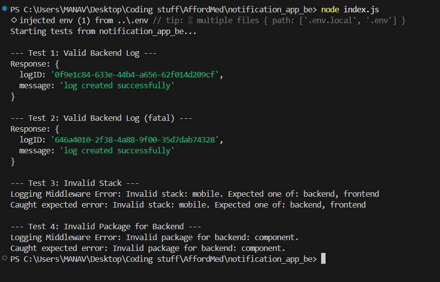

# Logging Middleware

## Implementation
I designed the middleware as a standalone, reusable package. The main module (`logger.js`) exports a single `Log(stack, level, package, message)` function. 

Before sending any POST request, the function performs input validation to ensure the provided stack, log level, and package name match the system constraints.

Once the payload is validated, the module retrieves the secure JWT access token from the environment variables (`.env`) and makes an authenticated POST request to the evaluation service API.

## Testing & Output
I set up a dedicated test script (`index.js` in the backend folder) to verify the integration. It triggers multiple logs, including expected failures to test the validation logic.

below are the output screenshot showing successful logging calls and error handling for invalid packages:

